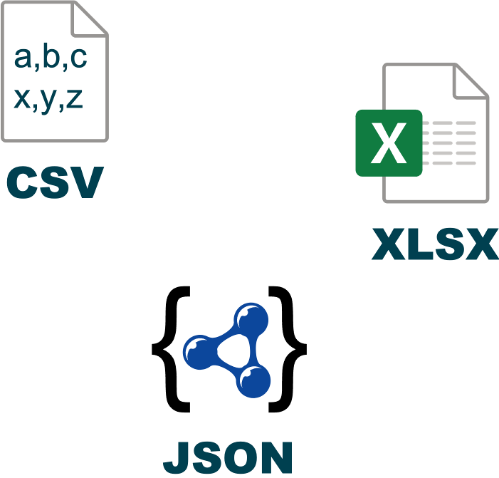

<!-- .slide: data-state="overview" -->
# From Data to Insight
### Day 1
* **Session** 9:30-16:30
---

### This session is going to start at **9:30am**
* Check your audio is working
* You need to plug in your speakers/headphones before you start the session.
* If you cannot hear your tutor when they are talking, you need to leave the session and log back in again.
* If you still cannot hear, let your tutor know by writing them a message in the chat box.
* If you are still experiencing problems
* Try disconnecting and reconnecting your PC/laptop to the internet.
* Call **0345 074 7958** to speak to the **QAHE Online Learning** support team.
* You can also email the team on **QAHEOnlineLearning@qa.com**

---

# We are recording now 🔴 <!-- .element style="text-align:center" -->

---

<!-- .slide: data-state="overview" -->
# From Data to Insight
### Day 1
* **Session** 9:30-16:30

---

## KSBs
### Knowledge (1 of 2)
| KSB       |                                                              |
|-----------|--------------------------------------------------------------|
| **K4₂**   | Data formats and their importance for analysis. Management and presentation tools to visualise and review data characteristics. Communication tools and technologies for collaborative working. |
| **K3₁**   | How to collate and format data in line with industry standards. |
| **K6₁₊₂** | The value of data to businesses. How to blend data from multiple sources. |

**Subscript = Assessment method**<br>**1:** Scenario Demonstrations with Questioning<br>**2:** Professional Discussion Underpinned by a Portfolio
<!-- .element: style="font-size: 0.6em; text-align: right;" -->

Note:

There are now a large number of KSBs associated with this module. The learners may find it daunting (and perhaps boring) if the learner goes through them all right at the start of Day 1.

Alternatively, the tutor could mention KSBs a few at a time on a per-activity basis. If this method turns out to work best then we can delete these KSB intro slides in a future version of these slides.

---

### Knowledge (2 of 2)
| KSB      |                                                              |
|----------|--------------------------------------------------------------|
| **K10₂** | Common data quality issues, e.g., misclassification, duplicate entries, spelling errors, obsolete data, compliance issues, and interpretation/translation errors. |
| **K9₁**  | Basic statistical methods and simple data modelling to extract relevant data and normalise unstructured data. |
| **K8₁**  | How to filter details, focusing on information relevant to the data project. |

**Subscript = Assessment method**<br>**1:** Scenario Demonstrations with Questioning<br>**2:** Professional Discussion Underpinned by a Portfolio
<!-- .element: style="font-size: 0.6em; text-align: right;" -->

---

### Skills (1 of 2)  
| KSB     |                                                              |
|---------|--------------------------------------------------------------|
| **S2₁** | Collect, format, and save datasets.                          |
| **S3₁** | Summarise and explain gathered data.                         |
| **S4₁** | Blend datasets from multiple sources and present them in an appropriate format. |
| **S5₁** | Manipulate and link different datasets as required.          |

**Subscript = Assessment method**<br>**1:** Scenario Demonstrations with Questioning<br>**2:** Professional Discussion Underpinned by a Portfolio
<!-- .element: style="font-size: 0.6em; text-align: right;" -->

---

### Skills (2 of 2)
| Code  | Description |
|--------|------------|
| **S10₂** | Demonstrate different ways of communicating meaning from data in line with audience requirements. |
| **S13₂** | Explain data and results to different audiences in a way that aids understanding. |
| **S17₂** | Operate as part of a multi-functional team. |
| **S6₁** | Use tools and techniques to identify trends and patterns in data. |

**Subscript = Assessment method**<br>**1:** Scenario Demonstrations with Questioning<br>**2:** Professional Discussion Underpinned by a Portfolio
<!-- .element: style="font-size: 0.6em; text-align: right;" -->

---

### Distinction Criteria
| Code  | Description |
|--------|------------|
| **D7₂** | Evaluate why we need to store, manage, and distribute data, and justify the importance of maintaining ethical and security standards. |
| **D2₁** | Justify why crosschecking of data is necessary. |

**Subscript = Assessment method**<br>**1:** Scenario Demonstrations with Questioning<br>**2:** Professional Discussion Underpinned by a Portfolio
<!-- .element: style="font-size: 0.6em; text-align: right;" -->

---

## Schedule 📅

<div style="clear: both;"><div style="float:left;width:calc(50% - 10px);padding-right:10px;">

### DAY 1: AM 🕤
* Types of data file 📂
* Formatting data 📝

</div><div style="float:right;width:calc(50% - 10px);padding-left:10px;">

### DAY 1: PM 🕟
* Filtering data 🔍
* Formulas and functions ➕

</div><div style="clear: both;"></div></div>

---

<div style="clear: both;"><div style="float:left;width:calc(50% - 10px);padding-right:10px;">

### DAY 2: AM 🕤
* Lookup functions 🔢
* Joining tables 🔗

</div><div style="float:right;width:calc(50% - 10px);padding-left:10px;">

### DAY 2: PM 🕟
* Joining tables (cont’d) 🔗

</div><div style="clear: both;"></div></div>

---

### DAY 3
* Power Query 💪🔍

---

## 🟢 Types of Data File 📂

---

## Types of Data File 📂
| KSB     |                                                              |
|---------|--------------------------------------------------------------|
| **K4₂** | Data formats and their importance for analysis.<br>Management and presentation tools to visualise and review data characteristics.<br>Communication tools and technologies for collaborative working. |

---

## Common Types of Data File 📂
<!-- .element: width="50%"-->

Note:

Learners will probably all have seen **CSV** and **XLSX** files before. **JSON** will be less familiar.

While all three file types were covered in the Online phase, extra recap may be required.

---

## CSV format
#### CSV: Comma-separated values
 <!-- .element: width="60%"-->

Note:

Key facts:
* **CSV** is a plaint-text format, suitable for storing unformatted numbers and text. (No font, colour, etc.)
* Since it is a text file, the CSV file contains no embedded metadata. (Unlike, e.g., a **JPEG**, **MP3** or **Microsoft Office** file.)
* The delimiter character is the comma.

---

## Knowledge Check 🧠
#### CSV: Comma-Separated Values

**Question 1.** What type of file is a **CSV** file?

* **A:** Image file 🖼️
* **B:** Plain-text file 📄
* **C:** Zip archive 📦
* **D:** Executable file ⚙️
* **E:** Excel file (same as XLSX) 📊

Note:

**Answer:** B – Plain-text file.

If any learners think the **CSV** format is the same as the **XLSX** format, it is probably worth pausing to recap the significant differences between the two.

---

## Knowledge Check 🧠
#### CSV: Comma-Separated Values

**Question 2.** What is the usual delimiter (separator) character in a **CSV** file?

* **A:** Tab `⠀⠀⠀`
* **B:** Colon `:`
* **C:** Space `⠀`
* **D:** Comma `,`
* **E:** Double-quote `”`
* **F:** Pipe `|`

Note:

**Answer:** D – Comma.

Answer at the top of the slide!

---

## Knowledge Check 🧠
#### CSV: Comma-Separated Values

**Question 3.** If we open a **CSV** file directly in **Excel**, what potentially unwanted transformations(s) could occur?

* **A:** Number **rounding**
* **B:** Date-like strings **converted to dates**
* **C:** Corrupted text due to **character encoding**, e.g., `£` instead of `£`
* **D:** **All of the above**

Note:

**Answer:** D – All of the above.

The tutor may wish to demonstrate by creating a CSV file in Notepad and showing that e.g. '5 jun' becomes 05/06/<current year>, and 000.12345678901234567890 becomes 0.123456789012345. This is data corruption!

(If anyone is interested: £ becomes £ due to differences between the UTF-8 and Windows-1252 character encodings. Rule of thumb: if we see odd symbols we didn’t expect, we should think 'character encoding mismatch'. At least one learner has failed EPA because of this problem.)

**Follow-up Q:** How can we open a CSV file in Excel with no danger of this kind of data corruption?

**Answer:** Power Query.

### Step 1: Open Notepad
1. Press `Windows + R`, type `notepad`, and press `Enter` (or open Notepad from the Start menu).

### Step 2: Create a CSV File
1. Type the following text exactly as shown (including quotes):

   ```
   "Date","Number"
   "5 jun","000.12345678901234567890"
   ```

2. Click **File > Save As**.
3. In the **Save as type** dropdown, select **All Files**.
4. In the **File name** box, type **data.csv** (ensure the extension is `.csv`).
5. Click **Save**.

### Step 3: Open the CSV File in Excel
1. Locate the saved `data.csv` file.
2. Double-click the file to open it in Microsoft Excel.

### Step 4: Observe the Data Corruption
1. Check the values displayed in Excel:
   - `"5 jun"` is likely converted to a date format such as **05/06/YYYY** (depending on regional settings).
   - `"000.12345678901234567890"` is displayed as **0.123456789012345** (losing precision beyond 15 digits).

### Step 5: Explain the Cause
1. **Automatic Date Formatting:** Excel assumes that "5 jun" is a date and automatically reformats it.
2. **Floating-Point Precision Limitation:** Excel only maintains up to 15 significant digits, truncating extra digits.

### Step 6: Discuss Solutions
To prevent this issue:
- Open CSV files **manually using "Get Data"** instead of double-clicking.
- Format columns **as text** before opening the file.
- Use an alternative program like **Notepad, Python, or a database** for data storage.

### 📌 Summary: What Does Power Query Solve?
| **Problem** | **Directly Opening CSV in Excel** | **Power Query Solution** |
|------------|----------------------------------|-------------------------|
| **Automatic Date Formatting** | `"5 jun"` → `05/06/2025` | Keeps `"5 jun"` as text unless manually converted |
| **Loss of Precision** | `000.12345678901234567890` → `0.123456789012345` | Preserves full text version of number |
| **Character Encoding Issues** | `£` → `£` (incorrect) | Allows selecting correct encoding (UTF-8, Windows-1252, etc.) |
| **Leading Zeros Removal** | `"000123"` → `"123"` | Keeps `"000123"` intact as text |
| **Incorrect Delimiter Interpretation** | May split incorrectly | Lets you choose delimiter manually |

### ❓ Key Takeaway
Power Query doesn’t "fix" Excel’s fundamental limitations (like 15-digit number precision), but it **prevents Excel from automatically corrupting data during import** by giving you control over data types and encoding.

---

## XLSX format
#### XLSX: Open Office XML
 <!-- .element: width="70%"-->

Internally, an **XLSX** file is mostly a collection of **XML** files.

Note:

The screenshot to the right shows the internal structure of an **XLSX** file.

Key facts:
* **XLSX** is the native file format for **Microsoft Excel** workbooks. **Excel** can both read and write **XLSX**.
* **XLSX** supports many types of content, including spreadsheets, charts, formulas, rich formatting, Tables, Named Ranges, images, and more.

Bonus facts (not essential to teach):
* An **XLSX** file is a **zip archive** containing a collection of **XML** files in a folder structure. There may also be embedded image files.
* **XML** files are plain-text file. Like **JSON**, **XML** can encode nested data structures. **XML** is more versatile but also more complex to read and write.
* The tutor may wish to show an example of an **XML** file, but this is not essential. We will not be studying **XML** files in the apprenticeship.

---

## Knowledge Check 🧠
#### XLSX: Open Office XML

**Question 1.** Which **Microsoft Office** application natively supports the **XLSX** format?

* **A:** Excel 📊
* **B:** PowerPoint 📽️
* **C:** Word 📝
* **D:** All of the above ⬆️

Note:

**Answer:** A – Excel
(Hoping 100% of learners know this.)

---

## Knowledge Check 🧠
#### XLSX: Open Office XML

**Question 2.** Consider the **XLSX**, **PPTX** and **DOCX** file formats: of these, the **XLSX** format is the most suitable for storing what type of content?

* **A:** Documents 📄
* **B:** Slideshows 📽️
* **C:** Spreadsheets 📊
* **D:** None of the above ❌

Note:

**Answer:** C – Spreadsheets

'Most suitable' is subjective but 99.9% of people should agree the answer is spreadsheets.

---

## Knowledge Check 🧠
#### XLSX: Open Office XML

**Question 3.** Which of these types of content cannot be stored in an XLS**X** file but can be stored in an XLS**M** file?

* **A:** Music 🎵
* **B:** Mathematical formulas ➕
* **C:** Macros 🤖
* **D:** Movies 🎬

Note:

**Answer:** C – Macros

Slightly tricky? This was mentioned in the Online content, but only once.

---

## JSON format
#### JSON: JavaScript Object Notation
 <!-- .element: width="40%"-->

---

## Knowledge check: JSON files
#### JSON: JavaScript Object Notation

**Question 1.** What type of file is a **JSON** file?

* **A:** Image file 🖼️
* **B:** Plain-text file 📄
* **C:** Zip archive 📦
* **D:** Executable JavaScript file ⚙️

Note:

**Answer:** B – Plain-text file

---

## Knowledge Check 🧠
#### JSON: JavaScript Object Notation

**Question 2.** What types of **collection** are supported by the **JSON** standard?

* **A:** Dictionaries and lists 📖
* **B:** Thesauruses and sets 📚
* **C:** Tables and cells 📊
* **D:** Files and folders 📂

Note:

**Answer:** A – Dictionaries and lists

If anyone asks:
* **Dictionary:** a set of key-value pairs where every key must be unique.
  `{'key1': 'value1', 'key2': 'value2', 'key3': 123.456}`

* **List:** an ordered array of unnamed values.
  `['value1', 'value2', 'value3', 1, 2, 3]`

* **Thesaurus:** not an actual collection type.

* **Set:** like a list, but every value must be unique. Sets are typically unordered. Not used in **JSON**.

---

## Knowledge Check 🧠
#### JSON: JavaScript Object Notation

**Question 2.** How can collections be nested in a **JSON** file?

* **A:** Lists can go inside lists
* **B:** Dictionaries can go inside dictionaries
* **C:** Lists can go inside dictionaries
* **D:** Dictionaries can go inside lists

Note:

**✅:** A and B only
**❌:** A, B, C and D

---

## 🟢 Formatting Data 📝

---

## Formatting Data 📝

| KSB       |                                                              |
|-----------|--------------------------------------------------------------|
| **K4₂**   | Data formats and their importance for analysis. Management and presentation tools to visualise and review data characteristics. Communication tools and technologies for collaborative working. |
| **K3₁**   | How to collate and format data in line with industry standards. |
| **K10₂**  | The range of common data quality issues that can arise e.g. misclassification, duplicate entries, spelling errors, obsolete data, compliance issues and interpretation / translation of meaning. |
| **S6₁**   | Use tools and techniques to identify trends and patterns in data. |


---

## Excel Number Formats 🔢

 <!-- .element: width="50%"-->

Note:

### Live Demo: Number Formats in Excel
The tutor should provide a live demo introducing **Number Formats in Excel**. The learners should follow along.

#### Key Learning Points
- Various **Number Formats** are available in Excel, including **Currency, Date, and Scientific**.
- In Excel, **cell value and cell Number Format are independent of each other**. This is worth emphasising and explaining clearly, as many learners do not know this.
- In Excel, **dates and times are actually serial numbers** that count from **00/01/1900**. Learners should not worry if they see a number when they were expecting a date.
- With the default Number Format, **'General'**, Excel applies a reasonable format based on the cell contents.
- Excel can store a number to a precision of approximately **16 digits**, but no more. This has **ramifications on data analytics!**  
  *(What problems could occur? The tutor can invite ideas from learners.)*

#### Suggestions for Additional Teaching
- A reference guide to Number Formats is provided: **'Excel Custom Number Formats.xlsx'**.  
  *(This is old and a bit rough, but it’s OK as a take-home reference guide.)*
- Prove that **cell value and cell Number Format are truly independent**.
- Show that **Excel dates and times are really serial numbers**.  
  Learners should learn to recognise that **serial number 45,500 ≈ approximately present day**.


---

## Conditional Formatting 🎨

 <!-- .element: width="70%"-->

Note:

### Live Demo: Conditional Formatting in Excel  
The tutor should provide a live demo introducing **Conditional Formatting in Excel**. The learners should follow along.  

#### Key Learning Points  
- **Greater Than / Less Than / Equal To**  
- **Duplicate Values**  
- **Colour Scales, Bars, Icons**  
- **The Advantages of Conditional Formatting**  

#### For More Advanced Learners  
- **Custom Formula**  
  *(Warning: Not many learners are experienced enough in Excel for this.)*  
- **Format an Entire Table Row Based on the Value in a Single Column**  
  *(For advanced learners only.)*  

---

# 🟢 Filtering Data 🔍

---

## Filtering Data 🔍

| KSB     |                                                              |
|---------|--------------------------------------------------------------|
| **K3₁** | How to collate and format data in line with industry standards. |
| **K8₁** | How to filter details, focusing on information relevant to the data project. |
| **S2₁** | Collect, format, and save datasets.                          |

Note:

**Warning**
* **K3** and **S2** are only partially satisfied in this activity.
* **K3** and **S2** will need further coverage elsewhere in the apprenticeship.

---

## Excel Tables 📊
 <!-- .element: width="60%"-->
In **Excel,** the **Table** is a convenient container for structured data.

Tables offer many useful functions, including:
* **Sorting** and **filtering**.
* Excel formula integration. **Tables** and **Table** columns can be referenced by name.
* Dynamic referencing. Formula references to Table columns always point to the entire column, even when the Table changes size.

Note:

Depending on the experience of the learners, the tutor may wish to deliver a short intro to **Tables** in **Excel** prior to moving learners on to the 'Basic Filtering' activity, which involves filtering a Table.

---

## Filtering in Excel 🔽

| **Open file**                         |
|---------------------------------------|
| 'Learner Guide - Basic Filtering.pdf' |

In this activity, we will learn how to apply various types of filter to an **Excel Table**, including:
* text and numeric filters.
* multi-column filters.
* stacking filters via `AND`.

---

## Filtering in Excel 🔽

| **Open file**                                           |
|---------------------------------------------------------|
| 'Learner Guide - Advanced Filtering.pdf' **(OPTIONAL)** |

In this activity, we will learn how to work with **Excel**’s advanced filter commands, including:
* defining the criteria range.
* specifying criteria.
* defining an advanced filter.
* applying Unique, Sort and Filter functions.

---

## Formulas and Functions in Excel 🔣

| **Open file**                                |
|----------------------------------------------|
| 'Learner Guide - Formulas and Functions.pdf' |

In this activity, we will learn how to work with Excel’s formulas and functions, including:

<div style="clear: both;"><div style="float:left;width:calc(50% - 10px);padding-right:10px;">

* Data input.
* Sorting data.
* `IF`, `COUNTIF`, `SUM IF`.
* `AND`б `OR`.

</div><div style="float:right;width:calc(50% - 10px);padding-left:10px;">

* Conditional formatting.
* `VLOOKUP`.
* `SUM`, `MAX`, `MIN`.

</div><div style="clear: both;"></div></div>


---

## Power Query Access ⚡
Check if you have the **Power Query** 💪🔍 feature in your **Excel**.

#datainsight <!-- .element: style="display:none" -->
