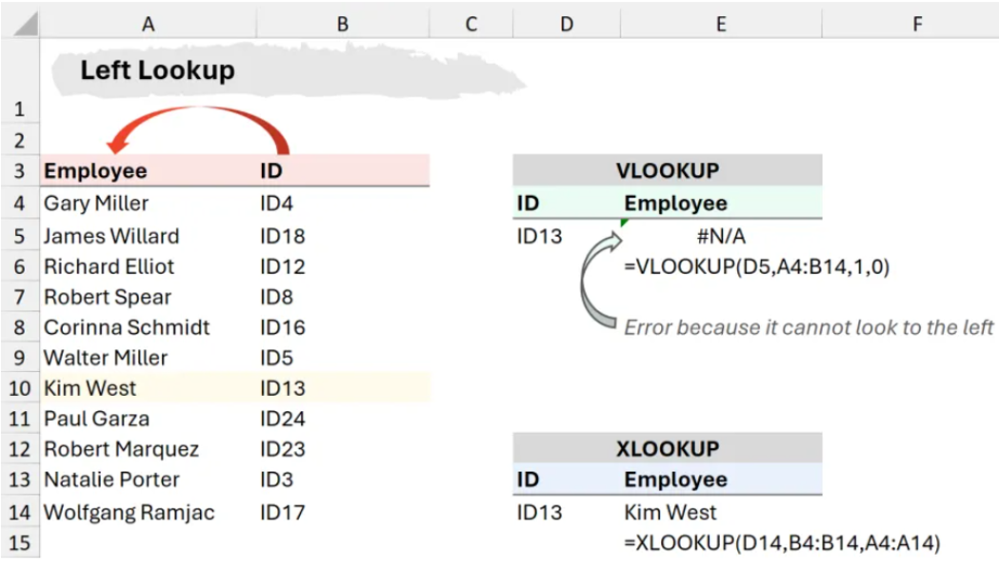

# From Data to Insight
### Day 2
* **Session** 9:30-16:30
<!-- .slide: data-state="overview" -->

---

### This session is going to start at **9:30am**
* Check your audio is working
* You need to plug in your speakers/headphones before you start the session.
* If you cannot hear your tutor when they are talking, you need to leave the session and log back in again.
* If you still cannot hear, let your tutor know by writing them a message in the chat box.
* If you are still experiencing problems
* Try disconnecting and reconnecting your PC/laptop to the internet.
* Call **0345 074 7958** to speak to the **QAHE Online Learning** support team.
* You can also email the team on **QAHEOnlineLearning@qa.com**

---

# We are recording now 🔴
<!-- .element style="text-align:center" -->

---

# From Data to Insight
### Day 2
* **Session** 9:30-16:30
<!-- .slide: data-state="overview" -->

---

## Power Query Access ⚡
Check if you have the **Power Query** 💪🔍 feature in your **Excel**.

Note:

If not done in day 1, all learners to check if they have PQ using the ‘Get data’ option.

Assign VMs to those who don’t.

Ask learners to have a look around the interface whilst you assign VMs to others.

---

## 🟢 Data Blending 🔄

---

## Data Blending 🔄

**What, why, how?**
* 🤔 What does it mean to ‘blend data’ together?
* 📊 Examples of data sources that can be used to blend data.
* 🎯 What are the benefits of data blending?
* 🛠 Methods of data blending.
* 🔍 Examples of data blending from your own role / organisation. If not applicable, general examples of data blending from any industry.

📖 Think, research, take notes.<br>
💬 Share with class.

Note:

15 mins to think, research and make notes.

Discuss as class.

---

## Data Blending 🔄

**Methods**
* 🔎 Lookup functions (`VLOOKUP`, `XLOOKUP`, etc.)
* 🔗 Joining/Merging data (horizontally ↔️)
* 📈 Appending data (vertically ↕️)

---

## Lookup Аctions 🔎

* 📌 `VLOOKUP`
* 🔍 `XLOOKUP`
* 🧩 `INDEX` and `MATCH`

<!-- .element: width="60%"-->

Note:

### VLOOKUP Explanation
- `VLOOKUP` searches for a value in the first column of a table and returns a corresponding value from a column to the **right**.
- Syntax:  
  ```excel-formula
  =VLOOKUP(lookup_value, table_array, col_index_num, [range_lookup])
  ```
- In the image, the formula used is:
  ```excel-formula
  =VLOOKUP(D5, A4:B14, 1, 0)
  ```
  - `D5`: The lookup value (ID13).
  - `A4:B14`: The table range (Employee names in column A, IDs in column B).
  - `1`: The column index to return (which is incorrect because VLOOKUP only retrieves data from the **right**, not from the left).
  - `0`: Exact match.

- **Issue with VLOOKUP:**
  - The formula tries to retrieve the employee name (column A) using `ID13` (column B).
  - Since `VLOOKUP` can only look **right** and column A is to the **left** of column B, it returns an error (`#N/A`).

### XLOOKUP Explanation
- `XLOOKUP` is more flexible and can look up values **in any direction** (left, right, or even return multiple values).
- Syntax:
  ```excel-formula
  =XLOOKUP(lookup_value, lookup_array, return_array, [if_not_found], [match_mode], [search_mode])
  ```
- In the image, the formula used is:
  ```excel-formula
  =XLOOKUP(D14, B4:B14, A4:A14)
  ```
  - `D14`: The lookup value (ID13).
  - `B4:B14`: The lookup array (ID column).
  - `A4:A14`: The return array (Employee column).

- **Why XLOOKUP Works:**
  - It searches for `ID13` in column B and returns the corresponding value from column A, solving the left lookup issue.

- `VLOOKUP` fails when looking to the left.
- `XLOOKUP` provides a more flexible and modern alternative that can search in **any direction** without requiring a fixed column index.

| Employee ID | Name             |
|------------|------------------|
| ID4        | Gary Miller      |
| ID18       | James Willard    |
| ID12       | Richard Elliot   |
| ID8        | Robert Spear     |
| ID16       | Corinna Schmidt  |
| ID5        | Walter Miller    |
| ID13       | Kim West         |
| ID24       | Paul Garza       |
| ID23       | Robert Marquez   |
| ID3        | Natalie Porter   |
| ID17       | Wolfgang Ramjac  |

---

## Joining/Merging Data 🔗

<!-- .element: width="60%"-->

* New **columns** are added.
* Based on there being a matching unique field in both tables (needed to join).

---

## Appending Data 🔽

<!-- .element: width="60%"-->

* New **rows** are added.

---

## 🟢 Lookup Functions 🔎

---

## Lookup Functions 🔎

| KSB     |                                                      |
|---------|------------------------------------------------------|
| **S5₁** | Manipulate and link different data sets as required. |

---

## XLOOKUP()
<!-- .element: width="70%"-->

| Open files                                       |
|--------------------------------------------------|
| [`Practice_with_XLOOKUP.pdf`](Practice_with_XLOOKUP.pdf) |
| [`Superstore.xlsx`](Superstore.xlsx)                    |

Note:

**Estimated Time: 20 minutes**
(Suggest adding headers for lookup and return values for better readability.)

#### First Demo: Using XLOOKUP with Five Arguments
**Demo File:** *Day 2 Demo (XLOOKUP) Superstore.xlsx* (Superstore data)

#### Important Notice
Some learners are using pre-365 versions of Excel. If applicable, instruct them on using `INDEX()` and `MATCH()` as an alternative to `XLOOKUP()`.

#### Key Learning Points
* How to use `XLOOKUP()` with example data.
* `XLOOKUP()` as a modern replacement for `VLOOKUP()`.
  * `VLOOKUP()` is inferior in all aspects except for backward compatibility.

#### ⠀Additional Teaching Suggestions
* Explain the `if_not_found` parameter in `XLOOKUP()`.

---

# 🟢 Joining Tables 🔗

---

## Joining Tables 🔗

| KSB   |                                                              |
|-------|--------------------------------------------------------------|
| K6₁₊₂ | **The value of data to the business**. How to undertake blending of data from multiple sources. |
| K9₁   | **Basic statistical methods** and simple data modelling to extract relevant data and normalise unstructured data. |
| S3₁   | Summarise and explain gathered data.                         |
| S4₁   | Blend data sets from multiple sources and present in format appropriate to the task. |

---

## Joining Tables 🔗

<!-- .element: width="100%"-->

Note:

Introduce the tables.

Ask learners to:
1. What is the benefit of joining the two tables?
2. What is a unique identifier? Use examples (customer table, Tesco database, college database, NHS database)
3. Which one exists here in both tables?
4. In order to join them, why do both tables have to have a common identifier?
5. Can a name/surname be a unique identifier?

### 1. What is the benefit of joining the two tables?  
Joining tables in Excel allows you to combine related data from different sources into a single table for analysis. This avoids duplication, saves time, and ensures accuracy. For example, merging a **Sales Table** with a **Customer Table** enables businesses to analyse purchases based on customer details.  

### 2. What is a unique identifier?  
A unique identifier is a column that contains distinct values for each record, ensuring that each row is uniquely identifiable. Some examples include:  
- **Customer Table**: Customer ID  
- **Tesco Database**: Clubcard Number  
- **College Database**: Student ID  
- **NHS Database**: NHS Number  

These unique identifiers prevent duplicate records and help link tables correctly.  

### 3. Which one exists in both tables?  
To join two tables, there must be a **common column** (e.g. **Customer ID, Product Code, or Order Number**) that appears in both tables with matching values. Identifying this shared field is essential for merging data accurately.  

### 4. Why do both tables need a common identifier to be joined?  
A common identifier ensures that data from one table correctly corresponds to data in the other. Without a shared identifier, Excel would not be able to match records, leading to errors or mismatched data.  

### 5. Can a name or surname be a unique identifier?  
No, a name or surname is **not** a reliable unique identifier because:  
- Many people can have the same name.  
- Names can change due to marriage or other reasons.  
- Spelling variations or typos can cause inconsistencies.  

Instead, using a **Customer ID, Student Number, or Employee ID** ensures accurate data matching when joining tables.  

---

### ⬅️ Left Join

<!-- .element: width="60%"-->

Note:

### **Steps for Performing a Left Join in Excel**
In Excel, a **Left Join** can be achieved using functions like `VLOOKUP`, `INDEX-MATCH`, or Power Query.

#### Given Data:

##### Left Table (OrderCustomer)
| OrderID | Customer |
|---------|---------|
| 1000    | Alice   |
| 2000    | Bob     |
| 2000    | Cathy   |
|         | Diego   |
| 3000    | Emily   |

##### Right Table (OrderValue)
| OrderNum | TotalValue |
|---------|------------|
| 1000    | 31.14      |
| 1000    | 15.92      |
| 2000    | 6.53       |
| 4000    | 58.97      |
|         | 9.32       |

### Applying Left Join in Excel
1. **Match the `OrderID` from the Left Table with `OrderNum` from the Right Table.**
2. **Return the corresponding `TotalValue` from the Right Table.**
3. **If no match is found, return `NULL` (or leave empty).**
4. **Keep empty values from the original tables unchanged.**

### Expected Output Table:
| OrderID | Customer | OrderNum | TotalValue |
|---------|---------|---------|------------|
| 1000    | Alice   | 1000    | 31.14      |
| 1000    | Alice   | 1000    | 15.92      |
| 2000    | Bob     | 2000    | 6.53       |
| 2000    | Cathy   | 2000    | 6.53       |
|         | Diego   |         |            |
| 3000    | Emily   | NULL    | NULL       |

### How to Do This in Excel:
#### Using Power Query (Recommended)
1. Select the **Left Table**, go to **Data → Get & Transform → From Table/Range**.
2. Select the **Right Table**, load it into Power Query using **From Table/Range**.
3. Perform a **Left Join**:
   - **Merge Queries** using `OrderID` from the Left Table and `OrderNum` from the Right Table.
   - Expand the `TotalValue` column.
4. Load the result back to Excel.

### Key Differences When Keeping Empty Values
- **If an `OrderID` or `OrderNum` is blank, it remains blank.**
- **Unmatched values from the Right Table (e.g., OrderNum 4000) are ignored.**
- **Customers without a matching order (Diego) will have empty values instead of "NULL".**

---

### ➡️ Right Join

<!-- .element: width="60%"-->

Note:

https://learn.microsoft.com/en-us/power-query/merge-queries-overview

---

### 🔀 Inner Join

<!-- .element: width="60%"-->

Note:

https://learn.microsoft.com/en-us/power-query/merge-queries-overview

---

### ↔️ FULL (Outer) Join
<!-- .element: width="60%"-->

Note:

https://learn.microsoft.com/en-us/power-query/merge-queries-overview

---

## Experiments with Joins 🧪


| Open files                                       |
|--------------------------------------------------|
| [`Joins_Playground.pdf`](Joins_Playground.pdf) |
| [`Joins_Playground.xlsx`](Joins_Playground.xlsx)                    |

Note:

“Joins Playground”  will allow learners to paste data directly into Excel and perform an {inner, left, right, outer} join using an intuitive interface.

The activity will run learners through a series of experimental joins until they have a strong intuitive understanding of the four basic types of join.

The activity may also satisfy S3 (“Summarise and explain gathered data.”) but this is currently uncertain.

---

## Lookup Formulas vs. Joins 🔎

❓**Question**<br>
* Could this **LEFT JOIN** operation be achieved in Excel using **only** lookup functions such as `XLOOKUP()` – with no copying and pasting?

📌 **If so:** prove it!<br>
📌 **If not:** explain why not.

- The output must update dynamically when data in the input tables changes.  
- If a new row is added to the **Left Table**, the output should include this row automatically.  
- If there are multiple matching rows in the **Right Table**, the output should include all matches, not just the first.  

Note:

Give learners no more than around 20 mins to think about the question and run their experiments.

**For clarity:** we are asking if we can achieve a dynamic left join using lookup functions alone. Dynamic: if we change the contents of the input tables, the output table updates correctly.

**Answer:** It is not possible to perform this join using only lookup functions and no copy & paste. Reason: the output table contains multiple matches for certain rows, e.g., “1000 | Alice”. A lookup function can’t return all matches—only the first match.

***Side note:** it actually is possible using more advanced formulas. If an advanced learner manages to write a LeftJoin `LAMBDA()` function then obviously they get full brownie points. If any learner claims they have achieved a dynamic left join using only lookup functions, ask them to add a new row to the Left Table. Does the output table now contain the new row? Probably not!*

Key learning points:
* Lookup functions can’t do everything! Joins are not “pointless”! Some learners need to see this from themselves to understand.
* A join returns all matching rows between two tables.
* A lookup function returns only the first match.

### 🔹 Final Answer
❌ **Lookup functions alone cannot perform a true LEFT JOIN** because:
1. **A lookup function returns only the first match**—it cannot dynamically return multiple matching rows.
2. **If a new row is added to the Left Table**, a lookup formula does not generate a corresponding new row in the output table (which a true LEFT JOIN would do).

### 🔹 Advanced Note for Strong Learners
- **A `LAMBDA()` function can simulate a LEFT JOIN dynamically.** If someone claims to have done this, ask them to add a new row—does the result update properly?
- **Lookup functions are powerful, but joins are essential in relational data processing.**

---

## Knowledge Check 🧠
### Joins 🔗

**Question 1.** What are the four basic types of join introduced earlier?

* **A:** Middle, left, right, full
* **B:** Up, left, right, down
* **C:** Inner, left, right, full
* **D:** Inner, left, right, outer

Note:

**Answer:** C – Inner, left, right, full.

---

## Knowledge Check 🧠
### Joins 🔗

**Question 2.** In a left join, which rows are **guaranteed** to make it into the output table?

* **A:** All rows from the Left Table
* **B:** All rows from the Right Table
* **C:** All rows from both the Left and Right tables
* **D:** No rows are guaranteed to make it into the output table

Note:

**Answer:** C – Inner, left, right, full.

---

## Knowledge Check 🧠
### Joins 🔗

**Question 3.** Which type of join do we need if the output table must contain only rows from the Left Table that have a match in the right Table **and vice versa**?

* **A:** Inner join
* **B:** Left join
* **C:** Right join
* **D:** Full join

Note:

**Answer:** A – Inner join. Only the matched rows from each input table are returned.

---

## Join (Merge) Data 🔗
### Power Query 💪🔍

| Open file                                        |
|--------------------------------------------------|
| [`Merge_Data_For_PQ.xlsx`](Merge_Data_For_PQ.xlsx) |

Note:

If time, demo all joins (and append, next slide).
If short on time, demo only left and inner join.

Demo merge – left, right, inner and outer joins using PQ, learners to follow along.

Afterwards, they can check it against their initial join (manual) activity outputs.

### Step 1: Load the Tables into Power Query
1. **Open Excel** and ensure your two tables are properly formatted as **Tables** (select your data, then press `Ctrl + T` to create a Table).
2. **Name your Tables** (Go to the "Table Design" tab and name them something meaningful, like `Table1` and `Table2`).
3. **Open Power Query**:
   - Go to the **Data** tab.
   - Click **Get Data** > **From Other Sources** > **From Table/Range**.
   - Do this for both tables one at a time.

### Step 2: Merge the Tables
1. Once both tables are loaded into **Power Query**, go to the **Home** tab in Power Query.
2. Click **Merge Queries** (or **Merge Queries as New** if you want to keep the original tables separate).
3. In the **Merge** window:
   - Select the first table.
   - Select the column that is the key for merging (e.g., "Customer ID").
   - Select the second table and choose the corresponding column.
   - Choose the **Join Kind**:
     - **Left Outer**: Keep all records from the first table.
     - **Right Outer**: Keep all records from the second table.
     - **Inner**: Keep only matching records.
     - **Full Outer**: Keep all records from both tables.
4. Click **OK**.

### Step 3: Expand the Merged Table
1. You will see a new column with a table icon.
2. Click the small expand button **(↔️ icon)** next to the new column.
3. Select the columns you want to include from the second table.
4. Click **OK**.

### Step 4: Load the Data into Excel
1. Click **Close & Load** (Top-Left in Power Query).
2. The merged data will now be inserted into Excel as a new Table.


---

## Append Data 📊
### Power Query 💪🔍

| Open file                                        |
|--------------------------------------------------|
| [`Append_Data_For_PQ.xlsx`](Append_Data_For_PQ.xlsx) |

Note:

Demo append using PQ, learners to follow along.

### How to Append Data in Excel using Power Query

Appending data in Power Query means stacking two or more tables on top of each other. This is useful when you have multiple datasets with the same structure and want to combine them into one.

### Step 1: Load the Tables into Power Query
1. **Ensure your data is in Tables**  
   - Select your dataset, press `Ctrl + T` to format it as a Table.
   - Name the tables meaningfully (e.g., `Sales2023` and `Sales2024`).

2. **Load the tables into Power Query**  
   - Go to the **Data** tab.
   - Click **Get Data** > **From Other Sources** > **From Table/Range**.
   - Repeat this step for each table you want to append.

### Step 2: Append Queries
1. **Open Power Query Editor**  
   - In Excel, go to **Data** > **Get Data** > **Query Editor** (if not already open).

2. **Append Queries**  
   - In Power Query, go to the **Home** tab.
   - Click **Append Queries** > **Append Queries as New** (this keeps the original tables intact).
   - In the Append window:
     - Select **Table1** as the first table.
     - Select **Table2** as the second table.
   - Click **OK**.

### Step 3: Check and Adjust the Combined Data
- Ensure that both tables have the same column names and data types.
- If column names do not match, Power Query may create separate columns instead of appending correctly.
- You can rename or reorder columns as needed.

### Step 4: Load the Data into Excel
1. Click **Close & Load** (Top-Left in Power Query).
2. The appended data will now be inserted as a new table in Excel.

#datainsight/day2