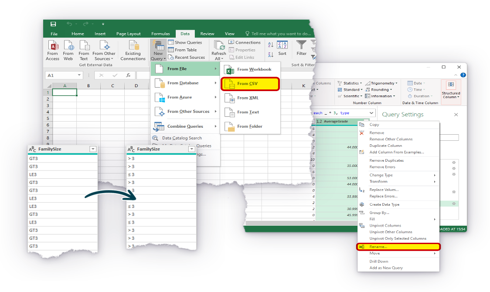

# From Data to Insight
### Day 3
* **Session** 9:30-16:30

<!-- .slide: data-state="overview" -->
---

### This session is going to start at **9:30am**
* Check your audio is working
* You need to plug in your speakers/headphones before you start the session.
* If you cannot hear your tutor when they are talking, you need to leave the session and log back in again.
* If you still cannot hear, let your tutor know by writing them a message in the chat box.
* If you are still experiencing problems
* Try disconnecting and reconnecting your PC/laptop to the internet.
* Call **0345 074 7958** to speak to the **QAHE Online Learning** support team.
* You can also email the team on **QAHEOnlineLearning@qa.com**

---

# We are recording now 🔴 
<!-- .element style="text-align:center" -->

---

# From Data to Insight
### Day 3
* **Session** 9:30-16:30

<!-- .slide: data-state="overview" -->

---

## Data Preparation 🏗️
#### Recap 🔄, Review 💬, Discuss 🗣️
* 📁 Describe benefits of using **different file types**.
* 🔗 Describe the benefits of **data blending** using examples.
* 🔀 Explain the difference between **merging (joins)** data and **appending** data.
* 💡 Describe examples for when you would use **each type of join** (from your own role or generic).

💪🏻 **Challenge** 
Describe, using examples the common data issues / errors / challenges you / your organisation experience when using data.

---

## 🟢 Power Query 💪🏻🔍

---

## Power Query 💪🏻🔍

| KSB       |                                                              |
|-----------|--------------------------------------------------------------|
| **K3₁**   | How to collate and format data in line with industry standards. |
| **K6₁₊₂** | **The value of data to the business.** How to undertake blending of data from multiple sources. |
| **K8₁**   | How to filter details, focusing on information relevant to the data project. |
| **K9₁**   | **Basic statistical methods** and simple data modelling to extract relevant data and normalise unstructured data. |

---

## Power Query 💪🏻🔍

| KSB     |                                                              |
|---------|--------------------------------------------------------------|
| **S4₁** | Blend data sets from multiple sources and present in format appropriate to the task. |
| **S5₁** | Manipulate and link different data sets as required.         |

---

## Intro to Power Query 💪🏻🔍

<!-- .element: width="100%"-->

  
| Open file                                                    |
|--------------------------------------------------------------|
| [Introduction_to_Power_Query.pdf](Introduction_to_Power_Query.pdf) |
| [student_grades.csv](student_grades.csv)                     |
| [column_from_examples.csv](column_from_examples.csv)         |

Note:

https://www.gov.uk/bank-holidays.json

---

## Inspect the Datasets 🔎

* 📥 **Download** the learner guide and datasets.

* 👀 Let’s take a look at both datasets and **inspect the data together**.

* ⏳ **Take 5 mins** to make notes on **any issues you find** in the `student_grades` dataset.

* 🗣️ **Discuss:**
  * ❗ **errors** found.
  * ⚡ **implications** of these errors.
  * 🧰 how you would **fix** them.

Note:

### Observations and Issues in `student_grades` Dataset:

#### ❗ Errors Found:
1. **Column Headers are Misaligned**  
   - The first row seems to contain descriptions, not actual data. This indicates a header row issue.
   
2. **Inconsistent Data Formatting**  
   - The `SexAge` column contains values like `F,18`, which should ideally be split into two separate columns: `Sex` and `Age`.
   - `FamilySize` has values such as `GT3` and `LT3`, which are abbreviations and need clearer labelling.
   - The `Romantic` column has "yes" and "no" values, which should be standardised (e.g., `1/0` or `True/False`).

3. **Columns with Explanations in Data**  
   - The first row provides explanations for values in `TravelTimeIndex`, `StudyTimeIndex`, and `Absences`. These should be removed and possibly stored separately as metadata.
   
4. **Data Type Issues**  
   - `Age` should be an integer, but it's combined with `Sex`.
   - `AverageGrade` is a floating-point number but should be checked for consistency (e.g., rounding issues).
   - `Absences` should be numeric but may contain unexpected values.

#### ⚡ Implications of These Errors:
- **Incorrect Analysis**: If the first row isn't removed, calculations will be incorrect.
- **Data Preprocessing Complexity**: The mixed formats make it harder to clean and analyse.
- **Interpretation Issues**: Without proper labelling, certain columns may be misinterpreted.

#### 🧰 How to Fix These Issues:
1. **Remove the First Row** (as it contains explanations, not actual data).
2. **Split the `SexAge` Column** into separate `Sex` and `Age` columns.
3. **Rename Columns** to more intuitive names (`FamilySize` → `Family_Size`, `AverageGrade` → `Final_Grade`).
4. **Convert Data Types**:
   - `Age` → Convert to `int`
   - `Absences` → Convert to `int`
   - `Final_Grade` → Convert to `float`
5. **Standardise Categorical Data**:
   - Convert "yes/no" values into `1/0` for consistency.
   - Clarify `FamilySize` categories (`GT3` → `>=3`, `LT3` → `<3`).

The dataset can be cleansed by addressing the following issues:
- Removed the first row with explanations.
- Split the `SexAge` column into `Sex` and `Age`.
- Renamed columns for clarity.
- Converted relevant columns to numeric types (`Age`, `Absences_Count`, `Final_Grade`).
- Standardised categorical values (e.g., `Romantic` converted to `1/0`).
- Ensured the dataset is ready for analysis.

Let me know if you need any additional modifications or insights! 🚀

---

## Intro to Power Query 💪🏻🔍

🔑 **Key learning points:**
* 🏁 How to open and close the **Power Query Editor**.
* 🖥️ The layout and core features of **Power Query**.
* 🏗️ How to apply some of the most common **data transformations**.

We will go through basics of the interface and dealing with tables and queries together as a group to get you started.

Note:

#### Step 1: Opening the Power Query Editor  
1. Open an Excel workbook.  
2. Navigate to the **Data** tab in the ribbon.  
3. Click on **Get Data** > **Launch Power Query Editor**.  
4. Alternatively, select a table, then go to **Data** > **From Table/Range** to open Power Query with data.  

👉 **Tip:** You can also open Power Query by using **Alt + D + P** (shortcut may vary).  

#### Step 2: Understanding the Power Query Interface  
#### Key sections:  
* **Query Pane** (Left side) – Lists all queries in your workbook.  
* **Data Preview Pane** (Center) – Displays the data and applied transformations.  
* **Ribbon Tabs** (Top) – Contains tools for transformations and query management.  
* **Applied Steps Pane** (Right side) – Tracks all changes made to the query.  

💡 **Remember:** Power Query is non-destructive, meaning original data remains unchanged!  

#### Step 3: Applying Basic Transformations  
Try these common transformations:  
* **Remove Columns**: Select a column, then click **Remove Columns** in the ribbon.  
* **Filter Data**: Click on a column dropdown and uncheck values you don’t need.  
* **Change Data Type**: Click a column > Home Tab > **Data Type** dropdown.  
* **Split Columns**: Use **Split Column** to divide data at a delimiter (e.g., comma).  
* **Merge Queries**: Use **Merge Queries** to combine data from multiple tables.  

#### Step 4: Closing & Loading Data  
1. After making changes, click **Close & Load** (Home Tab).  
2. Choose **Close & Load To…** if you want to load data into a table, PivotTable, or connection.  

<!--

- - -

## Apply Workplace Activity Review and Support

* Review the apply workplace activity.
* Read the brief.
* Ask questions if needed.
-->

#datainsight/day3<!-- .element: style="display:none" -->